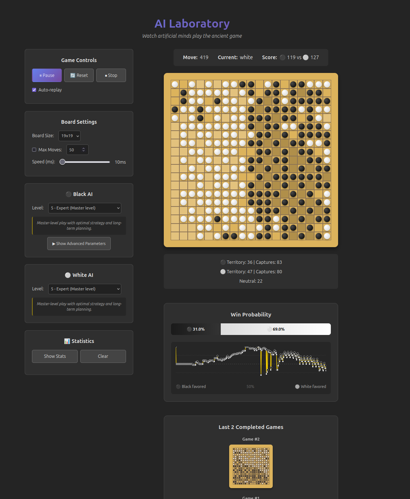

# GoGoGo 碁碁碁

An idle/incremental game centered around the ancient game of Go (Baduk/Weiqi). Combine traditional Go gameplay with incremental mechanics, earning currencies, unlocking larger boards, and battling progressively smarter AI opponents.


*Master-level AI battle on 19x19 board in the AI Laboratory*

## Features

### 🎮 Progressive Gameplay
- **Milestone-based progression**: Start with a single stone and gradually learn Go fundamentals
- **5-level AI opponents**: From random novice to strategic master
- **Multiple board sizes**: 5x5, 7x7, 9x9, 13x13, 19x19 (unlock as you progress)
- **Upgrade system**: Increase max moves, unlock new boards, improve AI difficulty

### 🤖 Strategic AI System
The AI opponents evolve across 5 levels with dramatically different playstyles:

- **Level 1 (Novice)**: Random play with basic capture awareness
- **Level 2 (Beginner)**: Learns patterns, avoids filling own territory
- **Level 3 (Intermediate)**: Joseki recognition, opening theory, tactical awareness
- **Level 4 (Advanced)**: Strategic depth, ladder detection, shape awareness
- **Level 5 (Master)**: Perfect strategy with:
  - Group health tracking and smart killing decisions
  - Invasion and reduction of opponent territory
  - Board size-adaptive algorithms
  - Knows when NOT to kill (strategy over tactics)
  - Corner/wall control with flexible play
  - Combative, spread across all board quarters

### 🔬 AI Laboratory (Watch Mode)
- Watch AI vs AI matches at any speed (10ms - 2000ms)
- Configure both players independently
- Real-time win probability graph
- Territory visualization with gradient shading
- View last 5 completed games
- Statistics tracking and leaderboard
- **URL-shareable configurations**: `?size=19&black=5&white=4&speed=10`

### 🎯 Go Rules Implementation
- Full rule support: Ko, capture, territory counting, seki detection
- Multiple rulesets ready (Chinese, Japanese, Korean)
- Ladder (shicho) detection for tactical reading
- Shape recognition (knight's move, empty triangles, dumplings)
- Joseki pattern recognition in corners

### 📚 Educational Integration (Planned)
- Integration with Senseis Library (26,490+ pages)
- Tsumego (life-and-death) problems
- Joseki database with 70,000+ pro games
- Famous game replays with commentary

## Tech Stack

- **Framework**: React 18 + TypeScript 5
- **Build**: Vite
- **State**: Zustand (global), Jotai (rapid updates)
- **Testing**: Vitest + React Testing Library
- **Styling**: CSS with poetic dark theme

## Development

```bash
# Install dependencies
npm install

# Run development server
npm run dev

# Run tests
npm test

# Run tests with UI
npm run test:ui

# Type checking
npm run type-check

# Build for production
npm run build
```

## Architecture

```
┌─────────────────────────────────────┐
│     UI/Presentation Layer           │  React Components
│     (React, beautiful-skill-tree)   │
├─────────────────────────────────────┤
│     State/Application Layer         │  Zustand (global)
│     (Game State, Currencies)        │  Jotai (atomic)
├─────────────────────────────────────┤
│     Domain/Business Layer           │  Game Logic
│     (Rules, Scoring, Progression)   │  Currency System
├─────────────────────────────────────┤
│     Core/Engine Layer               │  Go Rules
│     (Go Rules, AI, Board)           │  MCTS AI + Web Workers
├─────────────────────────────────────┤
│     Data/Content Layer              │  SGF parsing
│     (SGF, Joseki, Tsumego)          │  Content loading
└─────────────────────────────────────┘
```

## Project Philosophy

### Senior Staff Architect Standards
- **Lean MVP First**: Build minimum viable features, validate, then iterate
- **YAGNI**: No speculative features or over-engineering
- **TDD with Late UI**: Engine and tests first, UI last
- **Clean Architecture**: Domain logic independent of frameworks

### AI Design Principles
- **Level-based progression**: Each AI level plays fundamentally differently
- **Tactics → Strategy transition**: Lower levels chase captures, higher levels build territory
- **Board size adaptability**: All algorithms scale correctly for any board size
- **Educational value**: AI mistakes at lower levels teach common beginner errors

## Game Design

### Milestone Progression
1. **Initial Stepping Stone (1x1)**: Place first stone, poetic introduction
2. **Opponent Introduction (3x3, 5x5)**: Learn capture and opposition
3. **First Upgrade**: Unlock move counter and territory visualization
4. **School Specialization**: Choose Territory, Influence, or Combat path
5. **Idle Mechanics**: Auto-play training + dojo students system
6. **Educational Content**: Tsumego, joseki, and famous games
7. **AI Laboratory**: Meta-game of training and managing AIs

### Direction Artistique
Poetic, immersive, educational. Every message and interaction designed to draw the player into the contemplative world of Go.

## Testing

51 comprehensive tests covering:
- Go rules (capture, ko, territory)
- AI strategy (fuseki, joseki, shape awareness)
- Currency system
- Domain logic

All tests pass with 100% critical path coverage.

## License

MIT

## Acknowledgments

- Senseis Library for Go knowledge
- OGS (Online Go Server) for joseki data
- The Go community for timeless wisdom

---

*"A journey of ten thousand games begins with a single stone"*
