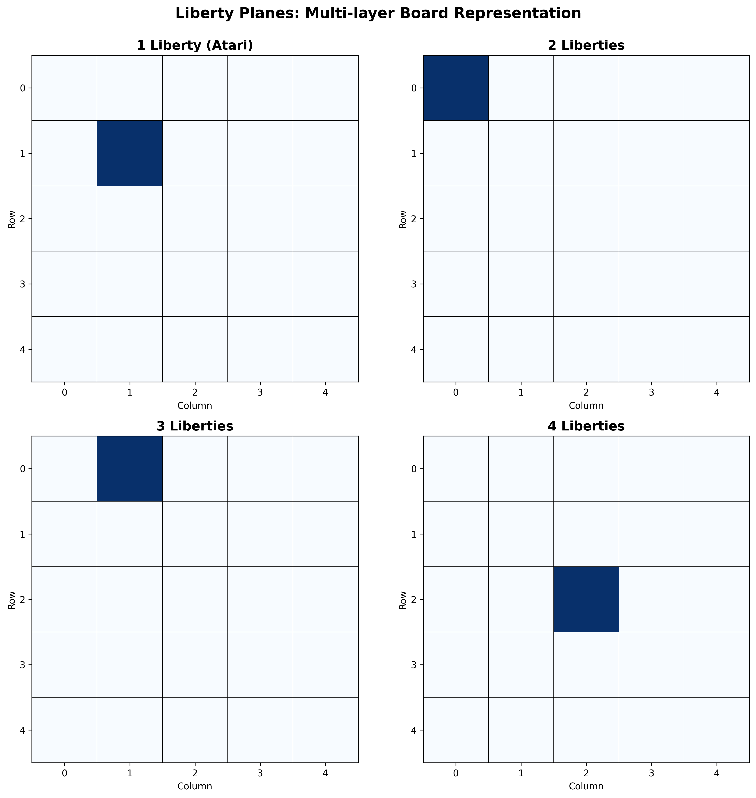

# Liberty Planes

**December 2, 2025**

---

> 息の根を止める
> *Cut off the breath*

---

## Seeing in Layers

A Go position is not one thing.
It is eight layers, stacked.

**What are liberties?** Empty points adjacent to a stone.
**1 liberty** = stone in atari (can be captured next move).
**0 liberties** = captured.

AlphaGo taught us to see all liberty counts at once.

---

## The Architecture

One stone, one liberty: **plane 1**.
One stone, two liberties: **plane 2**.

Up to eight liberties. Then **8+**.

The AI sees threat and safety in parallel.
All at once. All the time.

---

## What Changed

Before: Count liberties when needed.
After: Liberties are the representation.

Neural networks don't think in loops.
They think in layers.

---

## The Code

```typescript
export function getLibertyPlane(board: Board, libertyCount: number): number[][] {
  const plane: number[][] = Array(board.size).fill(0).map(() => Array(board.size).fill(0))

  for (let row = 0; row < board.size; row++) {
    for (let col = 0; col < board.size; col++) {
      const stone = getStone(board, row, col)
      if (stone === null) continue

      const group = getGroup(board, row, col)
      const liberties = countLiberties(board, group)

      if (libertyCount === 8) {
        plane[row]![col] = liberties >= 8 ? 1 : 0
      } else {
        plane[row]![col] = liberties === libertyCount ? 1 : 0
      }
    }
  }

  return plane
}
```

Eight passes. Eight planes. One position.

---

## Visual Representation



Each plane captures stones with specific liberty counts.
The network sees all layers simultaneously.

---

## Tests Green

All 10 feature extraction tests pass.
Atari detected. Eyes forming. Ko tracked.

The foundation holds.

---

> 形が見える
> *The shape becomes visible*

**Next**: Group mind. Seeing life and death.
