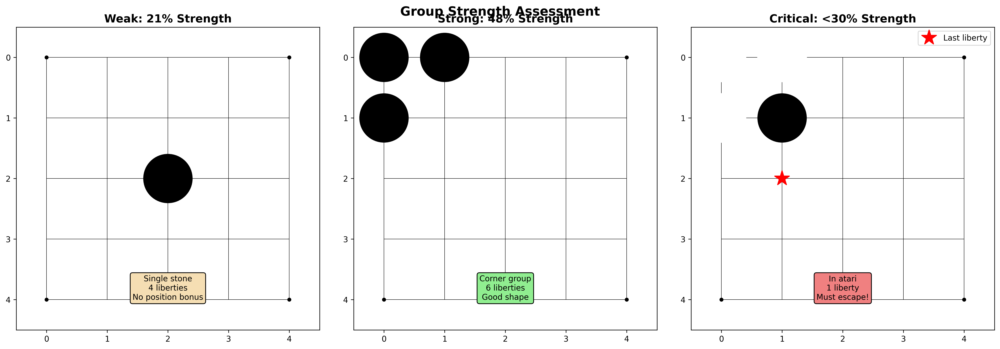

# Group Mind

**December 3, 2025**

---

> 二眼あれば活き
> *Two eyes live*

---

## Life and Death

A group is not just stones.
It breathes. It lives. It dies.

The algorithm must understand this.

---

## True Eyes

An empty point, surrounded.
Protected from invasion.
Controlled on the diagonals.

```typescript
export function hasEye(board: Board, pos: Position, color: Stone): boolean {
  if (getStone(board, pos.row, pos.col) !== null) return false

  const adjacent = getAdjacentPositions(board, pos.row, pos.col)
  for (const adjPos of adjacent) {
    const adjStone = getStone(board, adjPos.row, adjPos.col)
    if (adjStone !== color) return false
  }

  // Check diagonal control
  const diagonals = getDiagonalPositions(board, pos.row, pos.col)
  let controlled = diagonals.filter(d =>
    getStone(board, d.row, d.col) === color ||
    getStone(board, d.row, d.col) === null
  ).length

  return controlled >= Math.min(3, diagonals.length)
}
```

Orthogonal: must be same color.
Diagonal: mostly controlled.

One eye: unsettled.
Two eyes: alive.

---

## Group Strength

Not all groups are equal.

Corner groups, strong. Eyes, stronger.
Liberties matter. Position matters.



```typescript
strength = liberties * 0.4
         + eyes * 0.2
         + size * 0.1
         + position * 0.3
```

A formula. A heuristic. A start.

---

## Critical Points

Where does life hang?

The last liberty.
The eye point.
The cutting stone.

These are critical.

```typescript
export function getCriticalPoints(board: Board, pos: Position): Position[] {
  const critical: Position[] = []

  // All liberties critical if few remain
  if (liberties.size <= 2) {
    critical.push(...liberties)
  }

  // Eye points always critical
  for (const lib of liberties) {
    if (hasEye(board, lib, color)) {
      critical.push(lib)
    }
  }

  return critical
}
```

The AI will learn to defend these.

---

## All Tests Green

13 group analysis tests.
78 total tests passing.

Eye detection works.
Life/death assessment works.
Strength rating works.

The mind sees.

---

> 石の下に力三年
> *Three years of power beneath the stones*

**Phase 1 complete**. Board representation SOTA.

**Next**: Policy network. Move priors. Strategic intuition.
